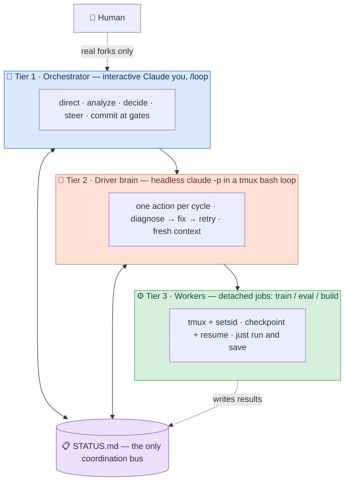

<div align="center">

# 🪆 claude-nested-autonomy

**Drive multi-hour autonomous tasks** with a 3-tier nested-Claude loop —<br/>
it survives SSH drops, fixes its own crashes, and pings you only for real decisions.

<br/>

[](LICENSE)
[](https://code.claude.com)
[](#-origin)
[](skills/nested-autonomy/SKILL.md)
[](https://github.com/Young-1231/claude-nested-autonomy/pulls)
[](https://github.com/Young-1231/claude-nested-autonomy/stargazers)

<br/>

`🔁 self-driving`&nbsp;·&nbsp;`🩹 self-correcting`&nbsp;·&nbsp;`👁 self-monitoring`&nbsp;·&nbsp;`🧪 self-analyzing`

</div>

---

> **TL;DR** — Ralph-in-a-loop, but **tiered**: a human-supervised orchestrator over a headless
> self-correcting brain over detached GPU/long jobs, all coordinated by **one `STATUS.md` file**,
> hardened with operational rules earned from a multi-day 7B GRPO training run.

## 📑 Contents
- [🤔 The problem](#-the-problem)
- [🏗️ Architecture](#️-architecture)
- [✨ What makes it work](#-what-makes-it-work)
- [🚀 Quickstart](#-quickstart)
- [🎚️ Config-driven setup](#️-config-driven-setup)
- [🛡️ The 10 hard rules](#️-the-10-hard-rules)
- [✅ Programmatic gate verification](#-programmatic-gate-verification)
- [🧰 Pre-placed helper scripts](#-pre-placed-helper-scripts)
- [🔒 On-demand safety hook](#-on-demand-safety-hook)
- [🧠 Cross-run memory](#-cross-run-memory)
- [🧬 Self-X mapping](#-self-x-mapping)
- [🪞 Progressive disclosure](#-progressive-disclosure)
- [🔀 Prior art & positioning](#-prior-art--positioning)
- [📦 Packaging & governance](#-packaging--governance)
- [📁 Repo layout](#-repo-layout)
- [⚠️ Caveats](#️-caveats)

## 🤔 The problem

A single interactive Claude session **can't** babysit a 12-hour training run:

| It… | …so this pattern |
| --- | --- |
| 💀 dies on SSH / session drop | pushes execution to **headless `claude -p` + tmux** |
| ⏳ blocks on every step | splits **decide/analyze** (you) from **execute/fix** (the brain) |
| 🪫 can't both charge ahead *and* reflect for the human | gives each job its **own loop & time scale** |
| 🧠 rots its context over hours | runs each cycle in a **fresh `claude -p`**, state carried by `STATUS.md` |

## 🏗️ Architecture



> Going **down** a tier: ⏱️ longer time scale, 🤖 more autonomy, 🙋 less human.
> Tiers 1 & 2 are **both Claude** (that's the *nesting*); Tier 3 is usually non-Claude long jobs
> (a training run, an eval) — but can be more `claude -p` sub-agents if the work is itself agentic.

## ✨ What makes it work

> It's **not** the layer count — it's these:

- 📋 **One shared `STATUS.md` as the only bus.** No tier calls another; they read/write the file.
- 🔌 **Persistence over liveness.** Long jobs survive disconnects (`tmux + setsid nohup </dev/null`).
- ♻️ **Restart + checkpoint-resume *is* the fault model** — not "never crash." Crashes are cheap to resume.
- 🧊 **Fresh context per cycle.** Each `claude -p` starts clean → no context rot; `STATUS.md` carries state.
- 🎯 **Integrity guard, enforced in code.** Gates advance only on real output run through
  [`lib/assert_gate.sh`](skills/nested-autonomy/lib/assert_gate.sh) — empty output = flush delay → re-run + cross-verify.
- 🚦 **Single-controller rule.** Steer by editing config / writing `STATUS`, **never** by grabbing the process.
- 🛎️ **NEEDS-USER gate.** Stop *only* for real forks (cost / irreversible / scientific fork / credential).
- 🏁 **Bounded autonomy.** Completion marker + `MAX_CYCLES` cap + `NEEDS-USER` pause + idle auto-stop.

## 🚀 Quickstart

**1. Install the skill** (Claude Code auto-discovers it):

```bash
# user-level (all projects)
mkdir -p ~/.claude/skills && cp -r skills/nested-autonomy ~/.claude/skills/
# …or project-level
mkdir -p .claude/skills && cp -r skills/nested-autonomy .claude/skills/
```

**2. Use it** — in any Claude Code session:

```text
Use nested-autonomy to drive: <your long task>.
```

Claude fills [`config.json`](skills/nested-autonomy/templates/config.json) by asking you a few structured questions,
scaffolds the three tiers from the templates, launches the brain
(`tmux new-session -d -s driver 'bash supervisor.sh'`), starts your Tier-1 `/loop`, and walks away.
You check back via `STATUS.md`; you're pinged only on `NEEDS-USER` forks.

<details>
<summary>📦 What gets scaffolded (copy-and-fill templates + pre-placed helpers)</summary>

| File | Tier | Role |
| --- | --- | --- |
| `config.json` | all | your setup context (paths, model ids, marker, caps) — filled via **AskUserQuestion** |
| `supervisor.sh` | 2 | brain loop: `while` + `claude -p` in tmux, anchored completion + max-cycles hatches, `--model` from config |
| `prompts/driver.md` | 2 | brain contract: integrity + authorization + env hard-rules + gated roadmap; asserts gates, appends scars |
| `prompts/monitor.md` | 1 | your self-paced `/loop` monitor (cache-aware pacing, careful-guard) |
| `STATUS.md` | all | the shared coordination bus (links config + scars file) |
| `lib/*.sh` | 1/2 | pre-placed helpers: healthcheck · launch_worker · sweep_orphans · assert_gate · restart_supervisor |
| `hooks/careful-guard.sh` | all | on-demand `PreToolUse` guard against catastrophic ops while unattended |

</details>

## 🎚️ Config-driven setup

Setup context lives in **[`templates/config.json`](skills/nested-autonomy/templates/config.json)**, not scattered through prompts.
On first run Claude fills it via **`AskUserQuestion`** (structured / multi-select), then every tier and helper reads from it:

- 🗂️ **paths** — repo, log dir, checkpoint dir, the `STATUS.md` location
- 🤖 **model tiering** — frontier id for Tier-1 reasoning, a cheaper id (e.g. `sonnet`) passed to `--model` for Tier-2 cycles + batch sub-work
- 🏁 **markers & caps** — `DONE_MARKER`, `MAX_CYCLES`, `IDLE_STOP`, cycle gap
- 🎯 **gate definitions** — what each gate asserts and its threshold

If anything's missing, Claude **asks** rather than guessing. One source of truth → no drift between the supervisor, the brain, and the helpers.

## 🛡️ The 10 hard rules

> Each rule encodes a **real failure** this pattern was hardened against — the `(Scar: …)` is the original wound.
> Full text with every scar preserved lives in **[`references/hard-rules.md`](skills/nested-autonomy/references/hard-rules.md)**.

| # | Rule | The scar it prevents |
| --- | --- | --- |
| 1 | 🔌 Long jobs run under `tmux + setsid nohup </dev/null` | bg jobs died on SSH drop / SIGHUP |
| 2 | 🔎 GPU/PID is ground truth, not the log | a stale log / cwd-mistaken `GONE` looked like a dead job |
| 3 | ♻️ Frequent restart + checkpoint-resume is the model | chasing "never crash" wastes time |
| 4 | 🚦 Single controller — steer by config, never grab the process | two controllers collided, wasted ~40 steps |
| 5 | 🎯 Never fabricate a gate; empty output → re-run + cross-verify | a flush delay almost got read as failure |
| 6 | 🛎️ Only stop for real forks (NEEDS-USER) | idle-waiting on a human kills throughput |
| 7 | 🧨 Sentinels self-match → match ANCHORED, never loosely | `pkill -f <pat>` killed its own script; a loose `grep` of the done-marker false-completed the run when the brain *quoted* it |
| 8 | ⚗️ Know your stack's incompatible "fixes" | a memory flag crashed the inference engine; host-ns orphans can't be killed in a container; worker pools leave GPU orphans |
| 9 | 🧯 Bounded autonomy — all four escape hatches are mandatory | a never-matching marker + no cap spun >1 day, burning quota for nothing |
| 10 | 📏 A gate on a small eval sample can be noise | a "regression" and a "+5.7pt win" both dissolved into ties at 5× the sample |

## ✅ Programmatic gate verification

Models fake "done." So a gate never advances on the brain's say-so — it advances on a **programmatic assertion** plus **captured evidence** pasted into `STATUS.md`.
[`lib/assert_gate.sh`](skills/nested-autonomy/lib/assert_gate.sh) exits non-zero unless the real state is reached:

| Mode | Asserts |
| --- | --- |
| `state-changed <path>` | a file/dir actually advanced since last check (new ckpt mtime / size) |
| `file-nonempty <path>` | the expected artifact exists **and** is non-empty |
| `marker <file> <token>` | the marker appears as **its own line**, not merely mentioned (rule 7) |
| `metric>=<thr> <cmd>` | run `<cmd>`, parse its number, clear the gate threshold |
| `session-dead <name>` | a tmux session is genuinely gone (liveness ground truth, not a stale log banner) |
| `cmd <shell…>` | generic escape hatch — passes iff the wrapped command exits 0 (test green, endpoint 200) |

The brain runs the assert, pastes the real command output, and only then writes the gate as passed. No eyeballing.

## 🧰 Pre-placed helper scripts

Boilerplate lives in **[`lib/`](skills/nested-autonomy/lib)** so Claude spends turns **orchestrating, not rewriting** crash-safe bash from memory.
Every helper honors this skill's own rules (anchored grep · `ps`→`kill <pid>` never `pkill -f` · `setsid nohup </dev/null` · GPU/PID is ground truth) and is both **source-able and runnable**:

- 🩺 **`healthcheck.sh`** — cross-verified liveness: tmux session + GPU util + log mtime + PID (no single signal trusted)
- 🚀 **`launch_worker.sh`** — crash-safe Tier-3 launch: `tmux + setsid nohup </dev/null` into a checkpoint dir
- 🧹 **`sweep_orphans.sh`** — reclaim GPU/RAM held by worker orphans via `ps`→`kill <pid>` (**never** `pkill -f`)
- ✅ **`assert_gate.sh`** — the gate assertions above
- 🔁 **`restart_supervisor.sh`** — gated restart, only when `no live session && done-marker-not-written`

## 🔒 On-demand safety hook

Tier-2 runs `claude -p --dangerously-skip-permissions` **unattended** — useful, and the single biggest blast-radius risk (see [Caveats](#️-caveats)).
[`hooks/careful-guard.sh`](skills/nested-autonomy/hooks/careful-guard.sh) is a session-scoped **`PreToolUse`** guard that **blocks catastrophic ops** while you're away:
`rm -rf /`, `DROP TABLE`, `git push --force`, `kubectl delete`, loose `pkill -f`, and friends.

It's **opt-in and session-scoped** (`/careful` to arm, `/freeze` to lock edits outside a dir) — not an always-on global. Wire it with the `settings.json` snippet in **[`hooks/README.md`](skills/nested-autonomy/hooks/README.md)**.

## 🧠 Cross-run memory

Scars shouldn't die with the session. The brain reads and **appends to a `scars.md`** kept in **`${CLAUDE_PLUGIN_DATA:-./.nested-autonomy}`** (append-only, cross-run):
each newly-verified fix or dead-end ("this flag crashes the engine", "these orphans need a sweep") is recorded once and respected forever.
This is what makes **rule 8** compound — the next run starts already knowing your stack's incompatible "fixes" instead of re-discovering them.

## 🧬 Self-X mapping

| Capability | Where it lives |
| --- | --- |
| 🔁 **self-drive** | Tier-2 `while` loop ("one action/cycle") + Tier-1 `/loop` self-pacing |
| 📡 **self-feedback** | the shared `STATUS.md` — every cycle reads the latest real state and reacts |
| 🩹 **self-correct** | brain contract: error → read logs → root-cause → fix → retry; checkpoint-resume; cross-run `scars.md` |
| 👁️ **self-monitor** | Tier-1 cross-verifies liveness via `lib/healthcheck.sh` (session + GPU + log + PID) and watches gates |
| 🧪 **self-analyze** | Tier-1 honest review (vs baseline, explain surprises, note limitations + statistical significance) |

> Full mapping with the "who owns X" rationale: **[`references/self-x-mapping.md`](skills/nested-autonomy/references/self-x-mapping.md)**.

## 🪞 Progressive disclosure

`SKILL.md` is now a **lean hub** (a table of contents / signpost, not a kitchen sink). It carries only the what/when, the 3-tier mental model, the all-important `STATUS` bus, and a compact setup flow — then **points into `references/`, `lib/`, and `hooks/` with "read X *when* Y" triggers**. Detail loads **on demand**, so the entry file stays cheap to read and the model isn't drowned in context it doesn't need yet.

| Read this… | …WHEN |
| --- | --- |
| [`references/hard-rules.md`](skills/nested-autonomy/references/hard-rules.md) | wiring the brain contract / debugging a failure mode |
| [`references/pacing-and-cost.md`](skills/nested-autonomy/references/pacing-and-cost.md) | choosing models / tuning `/loop` intervals |
| [`references/self-x-mapping.md`](skills/nested-autonomy/references/self-x-mapping.md) | "who is supposed to do X?" |
| [`references/prior-art.md`](skills/nested-autonomy/references/prior-art.md) | deciding native feature vs this pattern |
| [`references/troubleshooting.md`](skills/nested-autonomy/references/troubleshooting.md) | something's stuck/dead — symptom-driven runbook |

## 🔀 Prior art & positioning

> Built on well-known ideas — a specific, hardened *shape* of them for **durable, human-supervised,
> mixed Claude + non-Claude (GPU) long jobs**. Full write-up: **[`references/prior-art.md`](skills/nested-autonomy/references/prior-art.md)**.

| Prior work | What it is | We absorb / differ |
| --- | --- | --- |
| [**ralph-wiggum**](https://github.com/anthropics/claude-code/blob/main/plugins/ralph-wiggum/README.md) (Anthropic) | single in-session loop, completion-promise + max-iterations | **absorb** completion signal + max-cycles + fresh-context; **add** human tier, detached non-Claude workers, session-death survival |
| [**subagents**](https://code.claude.com/docs/en/agents) · [**Agent Teams**](https://code.claude.com/docs/en/agent-teams) | parallel agents in one session | use those for in-session **parallelism**; use this for **durability + sequential-resume + GPU jobs** (they compose) |
| [**multi-agent patterns**](https://claude.com/blog/multi-agent-coordination-patterns) (Anthropic) | the orchestrator-worker lineage | our tiers map onto it |
| [**autonomous-agent-harness**](https://github.com/affaan-m/everything-claude-code) (ECC) | cron-triggered isolated sessions + memory bridge | a cron is a valid Tier-2 trigger; same "persistent file as bridge" idea |
| [**cc-sdd**](https://github.com/gotalab/cc-sdd) · [**Tmux-Orchestrator**](https://github.com/absmartly/Tmux-Orchestrator) | spec-as-truth · tmux multi-Claude | `STATUS.md` = source-of-truth, generalized to any gated long task |

## 📦 Packaging & governance

This ships as a self-contained **Agent Skill folder** — `SKILL.md` + `references/` + `templates/` + `lib/` + `hooks/` + cross-run data — so it installs and travels as one unit.

- 🔌 **Install as a plugin / from a marketplace.** Drop the folder into `~/.claude/skills/` (or a plugin marketplace) and Claude auto-discovers it via the front-matter trigger spec — no per-project wiring.
- 🧪 **Sandbox → try → PR.** Run it in a **scoped sandbox/container you control**, watch one real task end-to-end through `STATUS.md`, then open a PR with any new scar appended to `references/hard-rules.md` (or `scars.md`). Scars only get **relocated or strengthened**, never deleted.
- 🗂️ **Skill category.** It lands squarely in Anthropic's **runbook / operational-harness** category — an executable procedure with verification baked in — carrying **reference**, **helper-script**, and **hook** material alongside (`references/troubleshooting.md` is the symptom-driven runbook).

## 🎖️ Origin

Battle-tested end-to-end driving a real **7B GRPO video-RL** project: multi-day training, dozens of
crash → diagnose → fix → resume cycles, OOM hunts, and a multi-stage SFT→RL pipeline — with minimal
human input. Every hard rule above is a scar from that run.

## 📁 Repo layout

```text
skills/nested-autonomy/
├── SKILL.md                      # LEAN hub: what/when, 3-tier model, STATUS bus, setup flow, pointers
├── templates/
│   ├── config.json               # setup context, filled via AskUserQuestion
│   ├── supervisor.sh             # Tier-2 brain loop (while + claude -p, completion + max-cycles hatches)
│   ├── driver.md                 # Tier-2 brain contract  (copied to prompts/driver.md at setup)
│   ├── monitor.md                # Tier-1 self-paced monitor loop (copied to prompts/monitor.md)
│   ├── STATUS.md                 # the shared coordination bus
│   └── scars.md                  # seed for cross-run memory (copied to ${CLAUDE_PLUGIN_DATA}/scars.md)
├── references/
│   ├── hard-rules.md             # the 10 hard rules, full scars
│   ├── prior-art.md              # prior art & positioning
│   ├── pacing-and-cost.md        # cache-aware pacing + model tiering
│   ├── self-x-mapping.md         # the self-X mapping
│   └── troubleshooting.md        # symptom-driven runbook
├── lib/
│   ├── healthcheck.sh            # cross-verified liveness: tmux + GPU + log-mtime + PID
│   ├── launch_worker.sh          # crash-safe Tier-3 launcher (tmux + setsid nohup </dev/null)
│   ├── sweep_orphans.sh          # kill GPU/RAM-holding orphans (ps → kill <pid>, never pkill -f)
│   ├── assert_gate.sh            # programmatic gate assertions + evidence
│   └── restart_supervisor.sh     # gated supervisor restart (no live session && marker-not-written)
└── hooks/
    ├── careful-guard.sh          # PreToolUse guard blocking catastrophic ops while unattended
    └── README.md                 # how to wire the hook (settings.json), /careful + /freeze framing
```

## 🎛️ Pacing & cost

- ⏱️ **Cache-aware pacing** — the prompt cache TTL is ~5 min: stay under ~270s when actively polling,
  jump to 1200–1800s when idle. Don't sit at exactly 300s.
- 💸 **Tier your models** — frontier model for Tier-1 reasoning; a cheaper model (e.g. `--model sonnet`)
  for Tier-2 cycles and batch sub-work, where most tokens sit.

> Details and the rationale: **[`references/pacing-and-cost.md`](skills/nested-autonomy/references/pacing-and-cost.md)**.

## ⚠️ Caveats

This runs `claude -p --dangerously-skip-permissions` unattended and lets the brain edit files and launch
jobs — run it in a **sandbox/container you control**, on a **scoped** task, and arm the
[careful-guard hook](#-on-demand-safety-hook) so catastrophic ops are blocked while you're away.
Batch `claude -p` shares your subscription rate limit; **keep concurrency low**.

---

<div align="center">

**Tier 1 thinks · Tier 2 drives · Tier 3 runs — and one `STATUS.md` keeps them honest.**

<sub>[MIT](LICENSE) · built with 🪆 nesting · scars earned on a multi-day 7B GRPO run</sub>

<sub><a href="#-claude-nested-autonomy">↑ back to top</a></sub>

</div>
