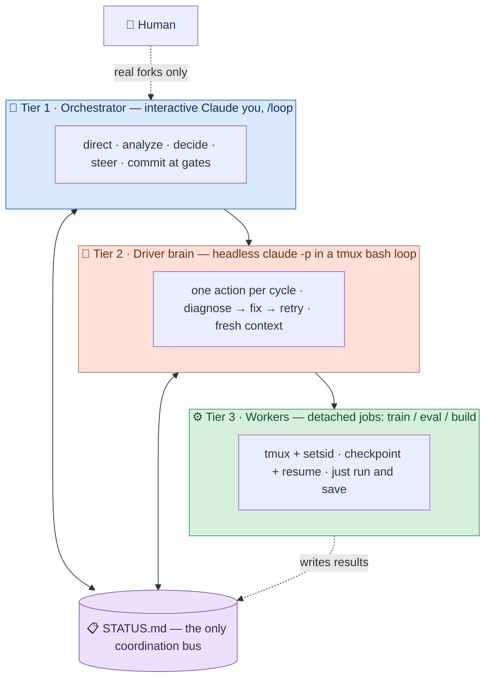

<div align="center">

# 🪆 claude-nested-autonomy

### A Claude Code skill that drives **multi-hour autonomous tasks** with a 3-tier nested-Claude loop — and keeps going after your laptop sleeps.

**Self-driving · self-correcting · self-monitoring · self-analyzing.**
Survives SSH drops. Fixes its own crashes. Pings you only for real decisions.

[](LICENSE)
[](https://code.claude.com)
[](#-origin)
[](skills/nested-autonomy/SKILL.md)
[](https://github.com/Young-1231/claude-nested-autonomy/pulls)


</div>

---

> **TL;DR** — Ralph-in-a-loop, but **tiered**: a human-supervised orchestrator over a headless
> self-correcting brain over detached GPU/long jobs, all coordinated by **one `STATUS.md` file**,
> hardened with operational rules earned from a multi-day 7B GRPO training run.

## 📑 Contents
- [🤔 The problem](#-the-problem)
- [🏗️ Architecture](#️-architecture)
- [✨ What makes it work](#-what-makes-it-work)
- [🚀 Quickstart](#-quickstart)
- [🛡️ The 8 hard rules](#️-the-8-hard-rules)
- [🧬 Self-X mapping](#-self-x-mapping)
- [🔀 Prior art & positioning](#-prior-art--positioning)
- [📁 Repo layout](#-repo-layout)
- [⚠️ Caveats](#️-caveats)

## 🤔 The problem

A single interactive Claude session **can't** babysit a 12-hour training run:

| It… | …so this pattern |
| --- | --- |
| 💀 dies on SSH / session drop | pushes execution to **headless `claude -p` + tmux** |
| ⏳ blocks on every step | splits **decide/analyze** (you) from **execute/fix** (the brain) |
| 🪫 can't both charge ahead *and* reflect for the human | gives each job its **own loop & time scale** |
| 🧠 rots its context over hours | runs each cycle in a **fresh `claude -p`**, state carried by `STATUS.md` |

## 🏗️ Architecture



> Going **down** a tier: ⏱️ longer time scale, 🤖 more autonomy, 🙋 less human.
> Tiers 1 & 2 are **both Claude** (that's the *nesting*); Tier 3 is usually non-Claude long jobs
> (a training run, an eval) — but can be more `claude -p` sub-agents if the work is itself agentic.

## ✨ What makes it work

> It's **not** the layer count — it's these:

- 📋 **One shared `STATUS.md` as the only bus.** No tier calls another; they read/write the file.
- 🔌 **Persistence over liveness.** Long jobs survive disconnects (`tmux + setsid nohup </dev/null`).
- ♻️ **Restart + checkpoint-resume *is* the fault model** — not "never crash." Crashes are cheap to resume.
- 🧊 **Fresh context per cycle.** Each `claude -p` starts clean → no context rot; `STATUS.md` carries state.
- 🎯 **Integrity guard.** Never fabricate a gate; empty output = flush delay → re-run + cross-verify.
- 🚦 **Single-controller rule.** Steer by editing config / writing `STATUS`, **never** by grabbing the process.
- 🛎️ **NEEDS-USER gate.** Stop *only* for real forks (cost / irreversible / scientific fork / credential).
- 🏁 **Completion signal + escape hatch.** Brain writes `ALL-GATES-PASSED`; supervisor has a `MAX_CYCLES` cap.

## 🚀 Quickstart

**1. Install the skill** (Claude Code auto-discovers it):

```bash
# user-level (all projects)
mkdir -p ~/.claude/skills && cp -r skills/nested-autonomy ~/.claude/skills/
# …or project-level
mkdir -p .claude/skills && cp -r skills/nested-autonomy .claude/skills/
```

**2. Use it** — in any Claude Code session:

```text
Use nested-autonomy to drive: <your long task>.
```

Claude scaffolds the three tiers from the templates, launches the brain
(`tmux new-session -d -s driver 'bash supervisor.sh'`), starts your Tier-1 `/loop`, and walks away.
You check back via `STATUS.md`; you're pinged only on `NEEDS-USER` forks.

<details>
<summary>📦 What gets scaffolded (copy-and-fill templates)</summary>

| File | Tier | Role |
| --- | --- | --- |
| `supervisor.sh` | 2 | brain loop: `while` + `claude -p` in tmux, with completion + max-cycles hatches |
| `prompts/driver.md` | 2 | brain contract: integrity + authorization + env hard-rules + gated roadmap |
| `prompts/monitor.md` | 1 | your self-paced `/loop` monitor (cache-aware pacing) |
| `STATUS.md` | all | the shared coordination bus |

</details>

## 🛡️ The 8 hard rules

> Each rule encodes a **real failure** this pattern was hardened against.

| # | Rule | The scar it prevents |
| --- | --- | --- |
| 1 | 🔌 Long jobs run under `tmux + setsid nohup </dev/null` | bg jobs died on SSH drop / SIGHUP |
| 2 | 🔎 GPU/PID is ground truth, not the log | a stale log / cwd-mistaken `GONE` looked like a dead job |
| 3 | ♻️ Frequent restart + checkpoint-resume is the model | chasing "never crash" wastes time |
| 4 | 🚦 Single controller — steer by config, never grab the process | two controllers collided, wasted ~40 steps |
| 5 | 🎯 Never fabricate a gate; empty output → re-run + cross-verify | a flush delay almost got read as failure |
| 6 | 🛎️ Only stop for real forks (NEEDS-USER) | idle-waiting on a human kills throughput |
| 7 | 🧨 `pkill -f <pat>` self-matches → `ps` for PID, then `kill` | `pkill -f` killed the script containing the pattern |
| 8 | ⚗️ Know your stack's incompatible "fixes" | a memory flag crashed the inference engine; host-ns orphans can't be killed in a container |

## 🧬 Self-X mapping

| Capability | Where it lives |
| --- | --- |
| 🔁 **self-drive** | Tier-2 `while` loop ("one action/cycle") + Tier-1 `/loop` self-pacing |
| 📡 **self-feedback** | the shared `STATUS.md` — every cycle reads the latest real state and reacts |
| 🩹 **self-correct** | brain contract: error → read logs → root-cause → fix → retry; checkpoint-resume; accreted "verified fix" notes |
| 👁️ **self-monitor** | Tier-1 cross-verifies liveness (session + GPU + log) and watches gates |
| 🧪 **self-analyze** | Tier-1 honest review on results (vs baseline, explain surprises, note limitations); surfaces forks |

## 🔀 Prior art & positioning

> Built on well-known ideas — a specific, hardened *shape* of them for **durable, human-supervised,
> mixed Claude + non-Claude (GPU) long jobs**.

| Prior work | What it is | We absorb / differ |
| --- | --- | --- |
| [**ralph-wiggum**](https://github.com/anthropics/claude-code/blob/main/plugins/ralph-wiggum/README.md) (Anthropic) | single in-session loop, completion-promise + max-iterations | **absorb** completion signal + max-cycles + fresh-context; **add** human tier, detached non-Claude workers, session-death survival |
| [**subagents**](https://code.claude.com/docs/en/agents) · [**Agent Teams**](https://code.claude.com/docs/en/agent-teams) | parallel agents in one session | use those for in-session **parallelism**; use this for **durability + sequential-resume + GPU jobs** (they compose) |
| [**multi-agent patterns**](https://claude.com/blog/multi-agent-coordination-patterns) (Anthropic) | the orchestrator-worker lineage | our tiers map onto it |
| [**autonomous-agent-harness**](https://github.com/affaan-m/everything-claude-code) (ECC) | cron-triggered isolated sessions + memory bridge | a cron is a valid Tier-2 trigger; same "persistent file as bridge" idea |
| [**cc-sdd**](https://github.com/gotalab/cc-sdd) · [**Tmux-Orchestrator**](https://github.com/absmartly/Tmux-Orchestrator) | spec-as-truth · tmux multi-Claude | `STATUS.md` = source-of-truth, generalized to any gated long task |

## 🎖️ Origin

Battle-tested end-to-end driving a real **7B GRPO video-RL** project: multi-day training, dozens of
crash → diagnose → fix → resume cycles, OOM hunts, and a multi-stage SFT→RL pipeline — with minimal
human input. Every hard rule above is a scar from that run.

## 📁 Repo layout

```text
skills/nested-autonomy/
├── SKILL.md                 # the skill: when/how, the 8 rules, self-X mapping, prior art, checklist
└── templates/
    ├── supervisor.sh        # Tier-2 brain loop (while + claude -p, completion + max-cycles hatches)
    ├── driver.md            # Tier-2 brain contract
    ├── monitor.md           # Tier-1 self-paced monitor loop (/loop)
    └── STATUS.md            # the shared coordination bus
```

## 🎛️ Pacing & cost

- ⏱️ **Cache-aware pacing** — the prompt cache TTL is ~5 min: stay under ~270s when actively polling,
  jump to 1200–1800s when idle. Don't sit at exactly 300s.
- 💸 **Tier your models** — frontier model for Tier-1 reasoning; a cheaper model (e.g. `--model sonnet`)
  for Tier-2 cycles and batch sub-work, where most tokens sit.

## ⚠️ Caveats

This runs `claude -p --dangerously-skip-permissions` unattended and lets the brain edit files and launch
jobs — run it in a **sandbox/container you control**, on a **scoped** task. Batch `claude -p` shares your
subscription rate limit; **keep concurrency low**.

---

<div align="center">

**License:** [MIT](LICENSE) · Built with 🪆 nesting and a lot of `STATUS.md`

</div>
